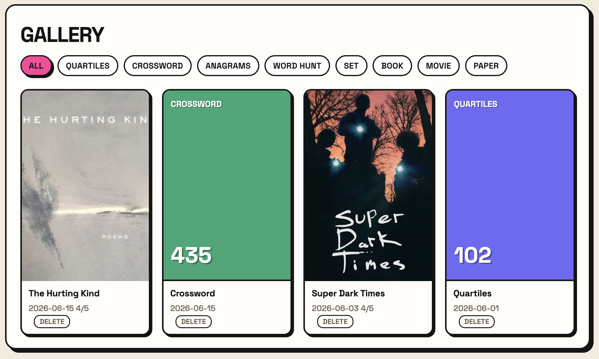

# tally

A local hobby tracker and gallery. One log for everything you do: books, movies,
daily word games (Quartiles, crossword), GamePigeon games (Anagrams, Word Hunt),
online Set, and papers you read for fun. It gives you two views over the same log: a
habit tracker (streaks, a calendar heatmap, personal bests) and a gallery (a visual
grid of covers, posters, and score cards).



Most of these hobbies are closed apps with no API or export, so v1 is manual: a fast
one-tap log for daily games and a short form for everything else. The logging is the
habit. Auto-import for the few open sources (Letterboxd, Goodreads, papers) can come
later.

## Run it

```bash
git clone https://github.com/s-eun-young-g/hobby-tracker
cd hobby-tracker
uv venv && uv pip install -e .
tally            # serves on http://0.0.0.0:8000
```

Open http://localhost:8000 on your laptop. To log from your phone, share your LAN
address (for example http://192.168.1.42:8000) while on the same wifi.

## What it does

- Today: one tap to log a daily game, with an optional score, plus a short form to add
  a book, movie, paper, or a game you played.
- Tracker: per-hobby streaks, a calendar heatmap, totals, and personal bests (best
  Word Hunt, fastest crossword, longest reading streak).
- Gallery: a filterable grid. Entries with a cover or poster URL show the image;
  games show a generated score card so the wall still looks like a gallery.

Hobbies are defined in one file (`tally/hobbies.py`); add or change them there.

## How it works

`hobbies.py` defines each hobby (category, whether it is daily, score direction,
which fields it shows). `db.py` stores a single `entry` table. `stats.py` computes
streaks, bests, and the heatmap as pure functions. The web layer (FastAPI, Jinja2,
HTMX) renders the Today, Tracker, and Gallery views. SQLite holds everything locally.

## Develop

```bash
uv pip install -e ".[dev]"
pytest
```

## License

MIT
